# Manuale tecnico

## Requisiti 

 * PHP versione 8.2
 * PostgreSQL 16.6

Si assume che il progetto venga eseguito su una distribuzione Linux, e' stato testato su NixOS 24.11; il file default.nix
serve in questo sistema operativo per evitare installazioni globali.

## Schema concettuale (ER)

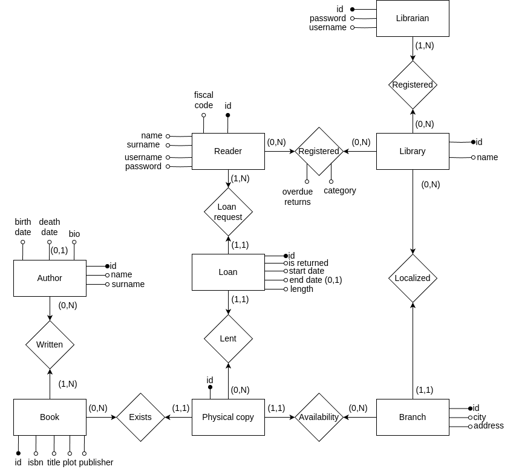

## Schema logico (relazionale)

author(<ins>id</ins>, name, surname, bio, birth_date, death_date*)<br />
book(<ins>id</ins>, isbn, title, publisher, plot)<br />
author_book(<ins>id_author, id_book</ins>)<br />
physical_copy(<ins>id</ins>, id_book, id_branch)<br />
loan(<ins>id</ins>, id_reader, id_physical_copy, start_date, end_date*, length, is_returned)<br />
reader(<ins>id</ins>, fiscal_code, username, password, name, surname)<br />
librarian(<ins>id</ins>, username, password, email)<br />
library(<ins>id</ins>, name)<br />
library_reader(<ins>id_library, id_reader</ins>, overdue_returns, category)<br />
library_librarian(<ins>id_library, id_librarian</ins>)<br />
branch(<ins>id</ins>, id_library, city, address)<br />

## Configurazione

Il progetto non ha bisogno di credenziali di superuser per poter essere eseguito.
I seguenti comandi si intendono come eseguiti dalla root del progetto.

Creare un database seguendo i dati di configurazione nella cartella scripts, eseguire il setup iniziale e 
far partire il servizio di PostgreSQL

```shell
$ ./scripts/postgresql-setup.sh
$ ./scripts/postgresql-start.sh
```

Far partire PHP in ascolto localmente

```shell
$ ./scripts/php-start.sh
```

Si puo' fare reset del database per riportarsi in una situazione iniziale pre-configurata 

```shell
$ ./scripts/postgresql-reset.sh
```

Per fermare il servizio di PostgreSQL

```shell
$ ./scripts/postgresql-stop.sh
```

## Funzionalita' realizzate con strutture interne della base di dati

### Blocco prestiti a lettori ritardatari

**Requisito**: un prestito può essere concesso solo se il lettore che lo richiede ha meno di 5 riconsegne in ritardo all’attivo.

**Implementazione**: la funzione `check_overdue_loans()` e il relativo trigger `trigger_check_overdue_loans` 
impediscono l'inserimento di un nuovo prestito se il lettore ha già 5 o più riconsegne
in ritardo. 
La verifica viene effettuata controllando il numero di ritardi registrati nella 
tabella `library_reader`.

### Numero massimo di prestiti

**Requisito**: I lettori di categoria "base" possono avere al massimo 3 volumi 
in prestito, mentre i lettori di categoria "premium" possono averne al massimo 5.

**Implementazione**: la funzione `ensure_max_loans()` e il relativo trigger 
`trigger_ensure_max_loans` verificano il numero di prestiti attivi per un lettore 
in base alla sua categoria. 
Se il numero massimo consentito è raggiunto, il sistema genera un'eccezione e 
impedisce il nuovo prestito.

### Ritardi nelle restituzioni

**Requisito**: alla restituzione di un volume, se effettuata in ritardo, 
è necessario aggiornare il contatore dei ritardi del lettore.

**Implementazione**: la funzione `update_overdue_returns()` aggiorna il contatore 
`overdue_returns` nella tabella library_reader ogni volta che un prestito viene 
contrassegnato come restituito (`is_returned = TRUE`) e la restituzione 
è avvenuta dopo la data di scadenza.

### Disponibilità dei volumi

**Requisito**: un prestito può essere concesso solo se il volume richiesto è disponibile.

**Implementazione**: la funzione `check_physical_copy_availability()` e il relativo 
trigger `prevent_duplicate_loans` impediscono l’inserimento di un nuovo prestito 
se la copia fisica è già in prestito (ovvero, esiste un prestito attivo per la 
stessa copia).

### Proroga della durata di un prestito

**Requisito**: la proroga della durata di un prestito può essere concessa solo se 
il prestito non è già in ritardo.

**Implementazione**: la funzione `extend_loan()` consente di estendere la durata 
di un prestito solo se la data di scadenza originale è successiva o uguale
alla data corrente, impedendo così la proroga di prestiti già scaduti.

### Selezione della sede

**Requisito**: se il lettore specifica una sede per il prestito, il prestito può 
avvenire solo su copie presenti nella sede specificata. Se non disponibili, 
possono essere considerate copie di altre sedi previo avviso al lettore.

**Implementazione**: questo requisito viene gestito dall’applicazione che interagisce
con la base di dati. Tuttavia, la struttura della tabella `physical_copy` permette
di verificare la disponibilità di copie presso una specifica sede prima di 
procedere al prestito.

### Statistiche per ogni sede

**Requisito**: per ogni sede, è necessario mantenere il numero totale delle copie 
gestite, il numero totale dei codici ISBN gestiti e il numero totale di prestiti attivi.

**Implementazione**: la vista materializzata `branch_stats` fornisce una panoramica 
aggiornata sulla disponibilità e l'attività di prestito di ciascuna sede, 
aggregando i dati relativi a copie fisiche e prestiti in corso.

### Ritardi per ogni sede

**Requisito**: generare un report per ogni sede con i libri in prestito in ritardo
e i lettori che li hanno in carico.

**Implementazione**: la vista `overdue_readers_view` raccoglie informazioni sui 
lettori con prestiti in ritardo, collegandoli alla sede della biblioteca a cui 
appartengono. Questo consente di generare report dettagliati sui ritardi per ogni sede.

## Struttura del progetto

Segue una spiegazione di come e' strutturato il progetto

### config

Contiene la configurazione di PostgreSQL, su NixOS solo alcune cartelle sono in scrittura (ad esempio la home dell'utente)
quindi ho preferito far partire l'istanza del database nella cartella corrente, per fare questo ho dovuto modificare
la posizione della socket 

### db

Contiene il dump del database, da cui si puo' ripartire agevolmente con l'apposito script nel caso si facciano modifiche 
indesiderate in fase di esposizione.

### docs

Contiene la documentazione del progetto.

### pgsql

Contiene i dati relativi all'istanza di PostgreSQL.

### scripts

Contiene gli script utili a far partire il progetto.

### src

Suddivisa in admin/ e reader/ in base al tipo di utente che ha effettuato il login.
Eventuali file condivisi sono dentro src/ stessa.

## Screenshot di funzionamento

### Lettore

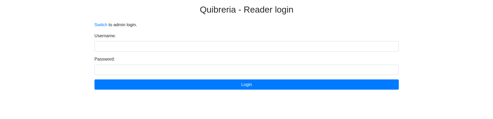
<figcaption style="margin-top: -25px; font-style: italic">Login</figcaption>

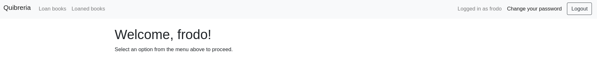
<figcaption style="margin-top: -25px; font-style: italic">Index</figcaption>

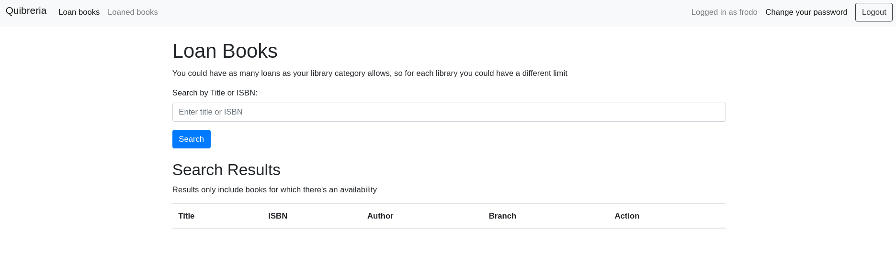
<figcaption style="margin-top: -25px; font-style: italic">Loan books</figcaption>

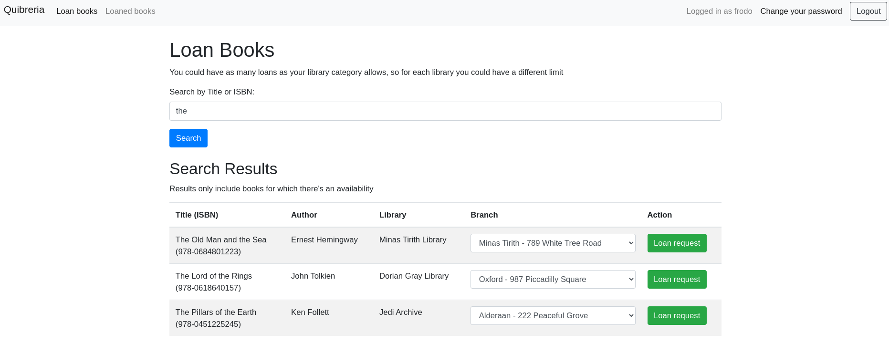
<figcaption style="margin-top: -25px; font-style: italic">Loan books dopo una ricerca per titoilo</figcaption>

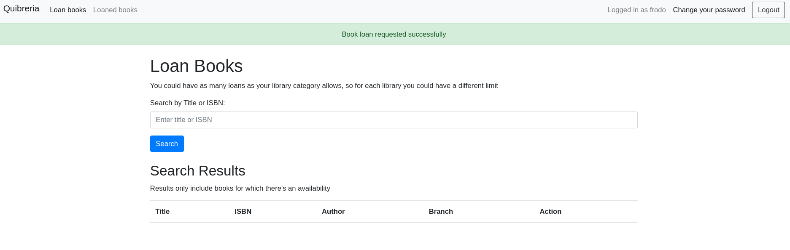
<figcaption style="margin-top: -25px; font-style: italic">Loaned book messaggio</figcaption>

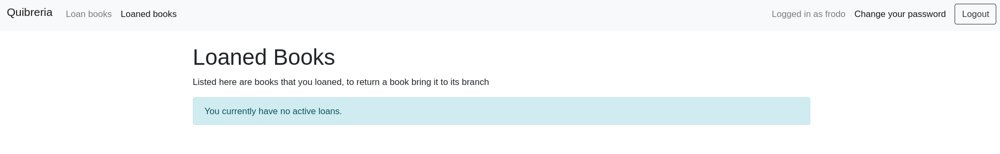
<figcaption style="margin-top: -25px; font-style: italic">Niente prestiti per questo utente</figcaption>

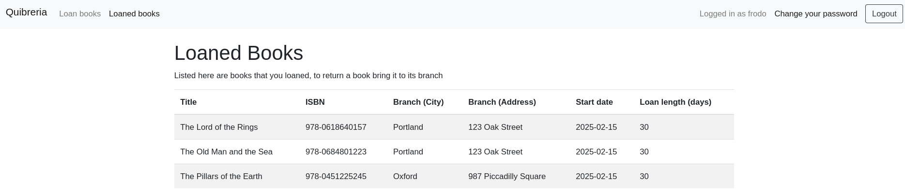
<figcaption style="margin-top: -25px; font-style: italic">Lettore con un eccellente gusto in fatto di libri</figcaption>

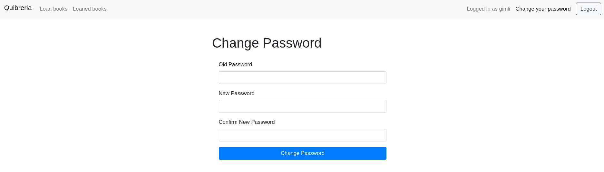
<figcaption style="margin-top: -25px; font-style: italic">Change password</figcaption>

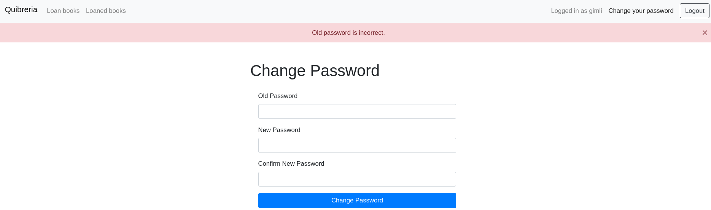
<figcaption style="margin-top: -25px; font-style: italic">Change password fallita perche' la vecchia password non e' corretta</figcaption>

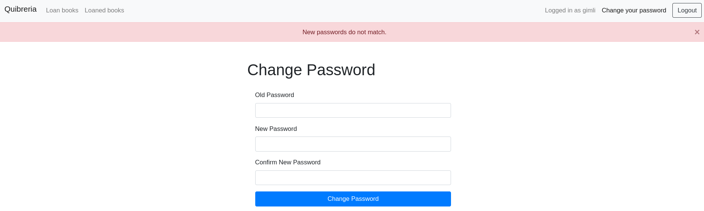
<figcaption style="margin-top: -25px; font-style: italic">Change password fallita perche' le password non corrispondono</figcaption>

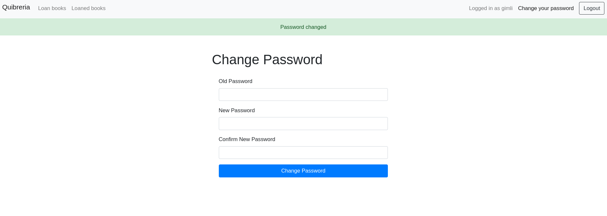
<figcaption style="margin-top: -25px; font-style: italic">Change password successo</figcaption>

### Bibliotecario

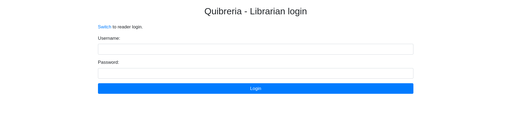
<figcaption style="margin-top: -25px; font-style: italic">Login</figcaption>

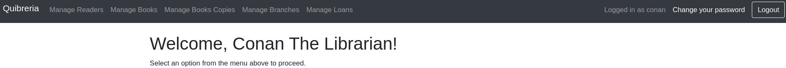
<figcaption style="margin-top: -25px; font-style: italic">Index</figcaption>

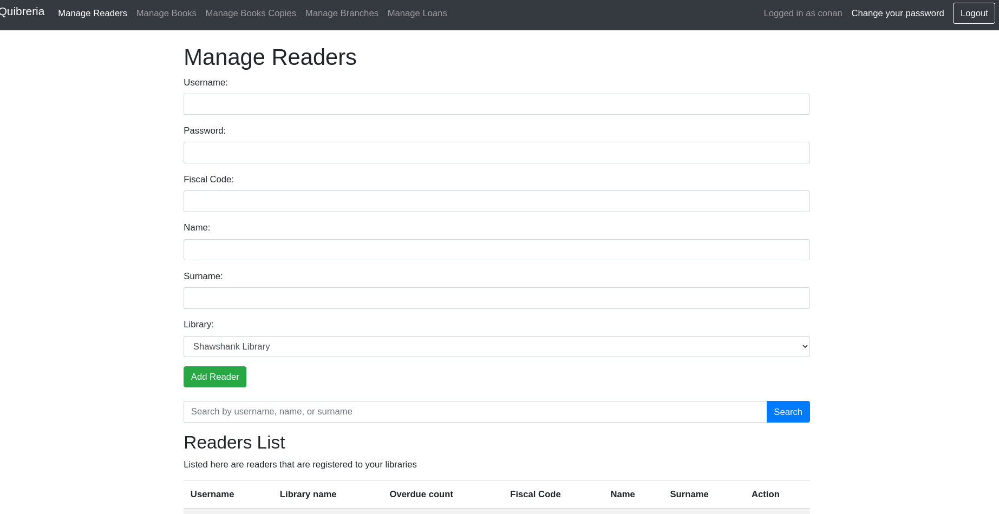
<figcaption style="margin-top: -25px; font-style: italic">Manage readers</figcaption>

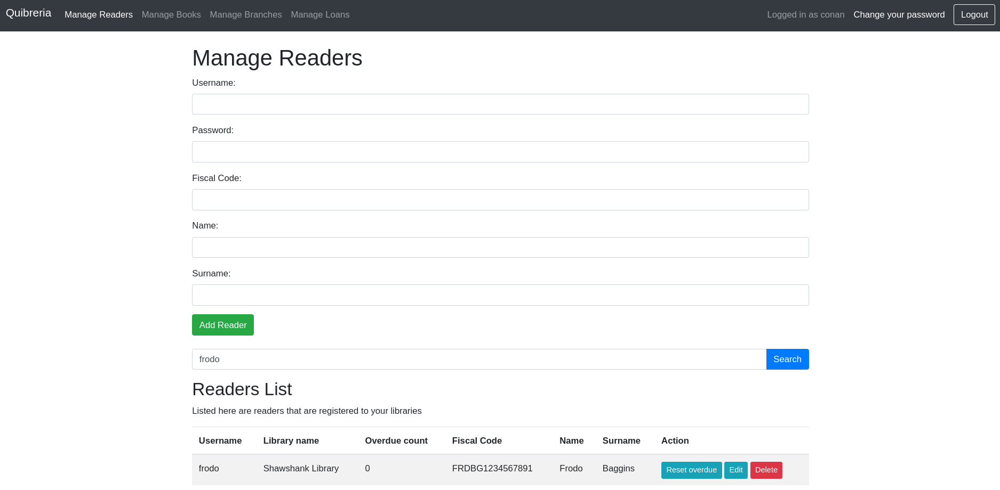
<figcaption style="margin-top: -25px; font-style: italic">Manage readers, trovato un reader attraverso la ricerca</figcaption>

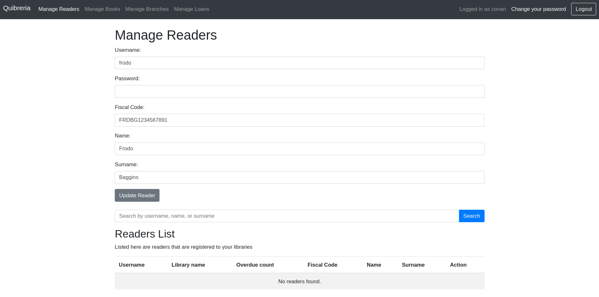
<figcaption style="margin-top: -25px; font-style: italic">Manage readers, modifica</figcaption>

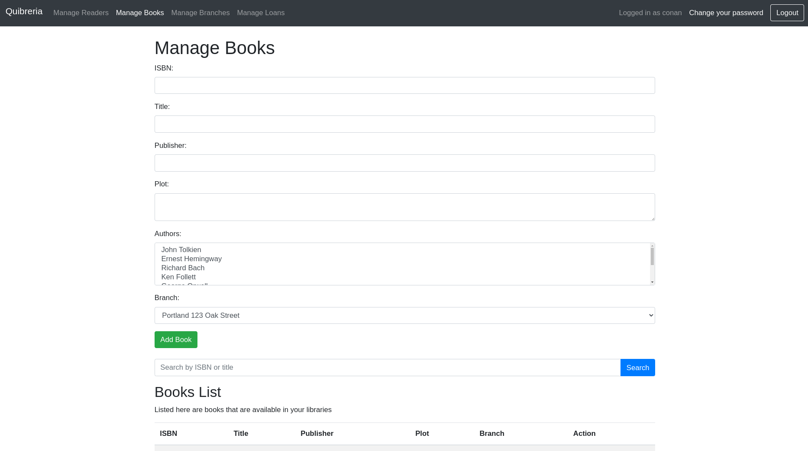
<figcaption style="margin-top: -25px; font-style: italic">Manage books</figcaption>

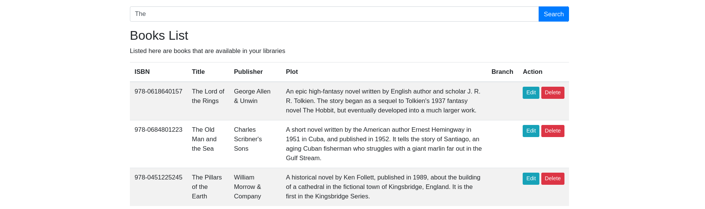
<figcaption style="margin-top: -25px; font-style: italic">Manage books, trovati libri che iniziano per "The"</figcaption>

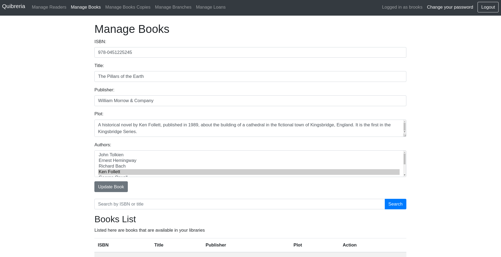
<figcaption style="margin-top: -25px; font-style: italic">Manage books, edit</figcaption>

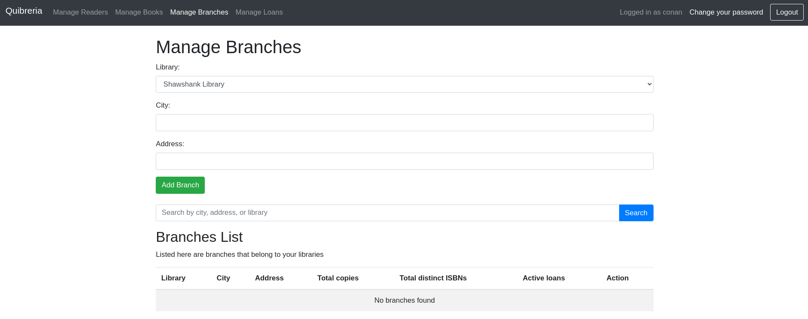
<figcaption style="margin-top: -25px; font-style: italic">Manage branches</figcaption>

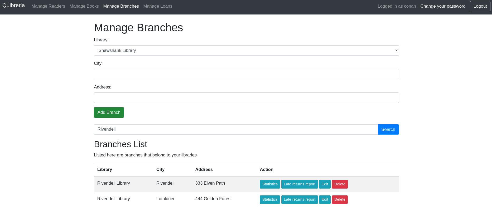
<figcaption style="margin-top: -25px; font-style: italic">Manage branches, trovate le sedi di Rivendell</figcaption>

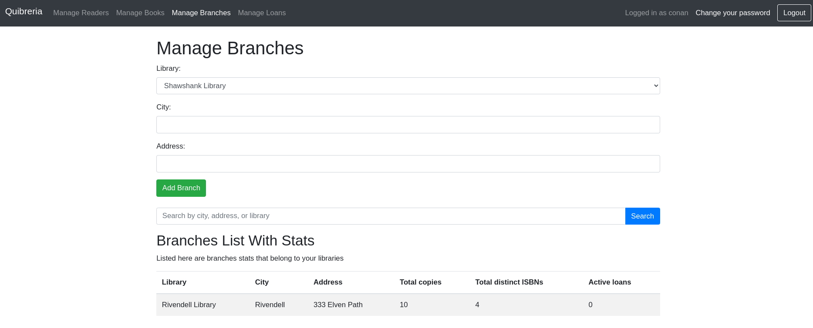
<figcaption style="margin-top: -25px; font-style: italic">Manage branches, statistiche per sede di Rivendell</figcaption>

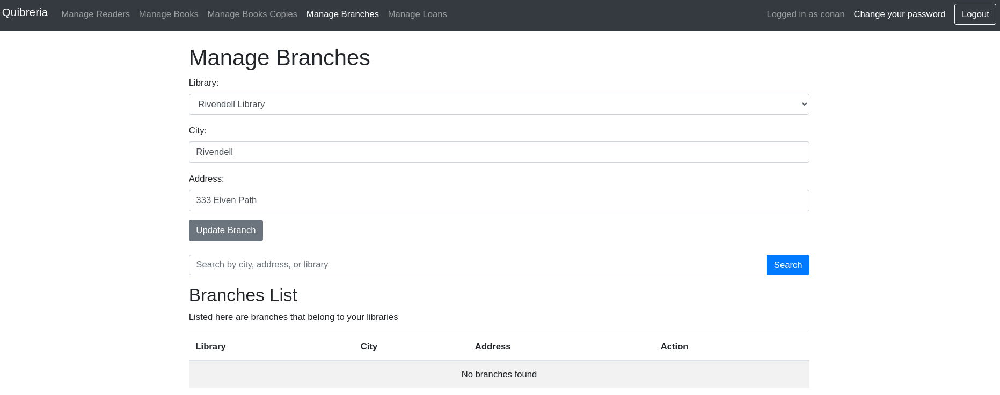
<figcaption style="margin-top: -25px; font-style: italic">Manage branches, edit</figcaption>

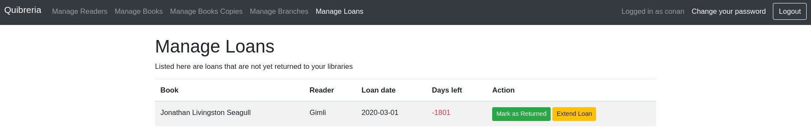
<figcaption style="margin-top: -25px; font-style: italic">Manage loans</figcaption>

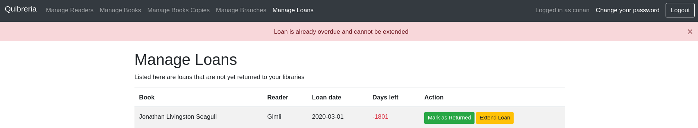
<figcaption style="margin-top: -25px; font-style: italic">Manage loans, non si puo' estendere un loan overdue</figcaption>

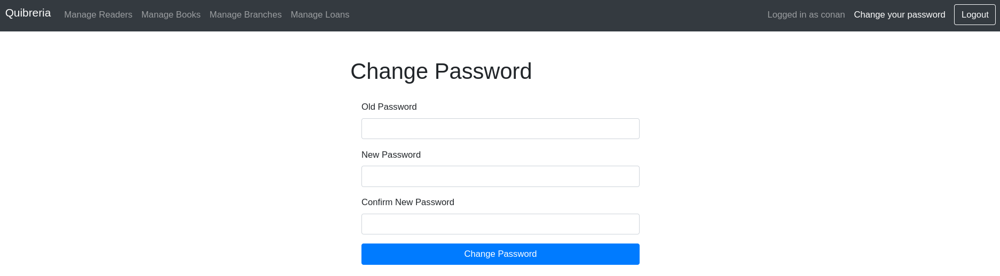
<figcaption style="margin-top: -25px; font-style: italic">Change password, come per il lettore</figcaption>
